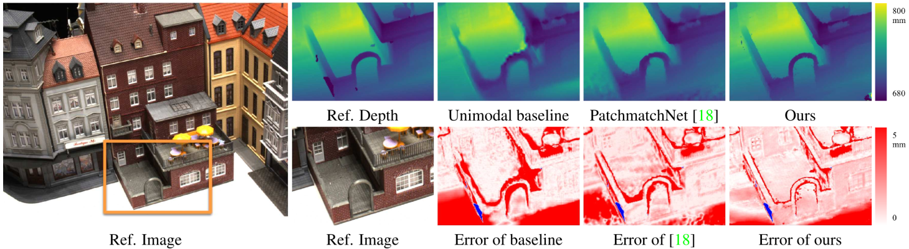
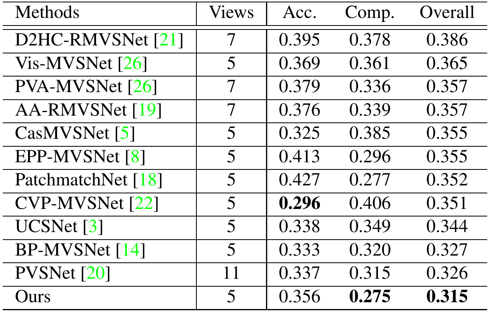

[](https://github.com/NVlabs/NP-CVP-MVSNet/blob/master/LICENSE)

## NP-CVP-MVSNet: Non-parametric Depth Distribution Modelling based Depth Inference for Multi-view Stereo

<div align="center">
  
</div>
<p align="center">
  Figure 1: NP-CVP-MVSNet can produce sharp and accurate depth estimation on boundary regions.
</p>

Non-parametric Depth Distribution Modelling based Depth Inference for Multi-view Stereo<br>
[Jiayu Yang](https://jiayuyang.me), [Jose M. Alvarez](https://rsu.data61.csiro.au/people/jalvarez/), and [Miaomiao Liu](http://users.cecs.anu.edu.au/~mliu/).<br>
CVPR 2022.

This repository contains the official Pytorch implementation for NP-CVP-MVSNet.

NP-CVP-MVSNet is a non-parametric depth distribution modeling based multi-view depth estimation network.

It can achieve superior performance on small objects and boundary regions, see Figure 1.

## Installation

This code is tested on following packages.

* CUDA 11.3
* PyTorch 1.10.1
* [torchsparse](https://github.com/mit-han-lab/torchsparse)

Follow the instructions in [here](https://pytorch.org/get-started/previous-versions/) to install PyTorch.

Follow the instructions in [here](https://github.com/mit-han-lab/torchsparse) to install torchsparse.

## Data preparation

Download the pre-processed DTU dataset from [CVP-MVSNet](https://github.com/JiayuYANG/CVP-MVSNet).

Extract it into ```dataset/dtu-train-512/``` folder.

## Training
We provide default parameters to train a 4 scale NP-CVP-MVSNet on the DTU dataset in the ```train.sh```

Modify training parameters and model parameters in ```train.sh``` and start training by
```
sh train.sh
```
Checkpoints will be saved in ```CKPT_DIR``` folder.

## Inference
Specify the ```TASK_NAME``` and ```CKPT_NAME``` in ```eval.sh``` to use the checkpoint you generated for validation or testing.

Inference depth map by 

```
sh eval.sh
```
Depth maps will be generated in ```OUT_DIR```.

## Depth Fusion
[fusibile](https://github.com/kysucix/fusibile) can be used to fuse all depth maps into a point cloud for each scan.

We use the modified version of fusibile provided by [MVSNet](https://github.com/YoYo000/MVSNet).

Check Yao yao's modified version of fusibile.

```
git clone https://github.com/YoYo000/fusibile
```

Compile fusibile.

```
cd fusibile
cmake .
make
```

Link fusibile executeable
```
ln -s FUSIBILE_EXE_PATH NP-CVP-MVSNet/fusion/fusibile
```
Scripts to launch fusibile for depth fusion can be found in ```fusion``` directory.

Set the correct path in ```fusion.sh``` and start depth fusion with following command.

```
sh fusion.sh
```

When finish, you can find point cloud ```*.ply``` files in ```DEPTH_FOLDER``` folder.

[Meshlab](https://www.meshlab.net/) can be used to display the generated point cloud ```.ply``` files.

## Evaluation
The official Matlab evaluation code and ground-truth point cloud can be downloaded from [DTU website](https://roboimagedata.compute.dtu.dk/?page_id=36).

The official evaluation code will compare the generated validation or testing point cloud ```.ply``` files with ground-truth point cloud provided by DTU and report the *accuracy* and *completeness* score, shown in Table 1. Overall score is the arithematic average of mean *accuracy* and mean *completeness* for all scans.

<div align="center">
  
</div>
<p align="center">
  Table 1: NP-CVP-MVSNet achieved best overall reconstruction quality on DTU dataset
</p>

## License
Please check the LICENSE file. NP-CVP-MVSNet may be used non-commercially, meaning for research or 
evaluation purposes only. 

For business inquiries, please contact 
[researchinquiries@nvidia.com](mailto:researchinquiries@nvidia.com).

## Citation
```
@article{yang2022npcvp,
  title={Non-parametric Depth Distribution Modelling based Depth Inference for Multi-view Stereo},
  author={Yang, Jiayu and Alvarez, Jose M and Liu, Miaomiao},
  journal={CVPR},
  year={2022}
}
```
